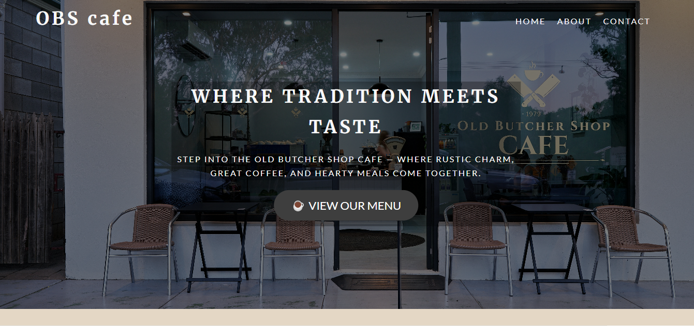
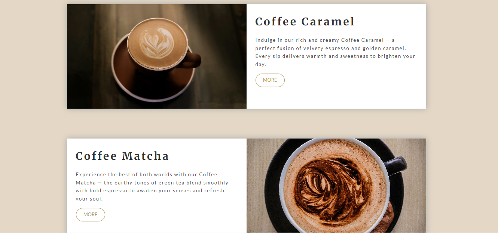

CSS Practice Websites ✨
By Marriam Tahir
Welcome to my CSS Practice Projects repository! Here, I build and experiment with different websites to improve my front-end development skills, focusing on HTML & CSS.

📌 Projects Included
1. Coffee Website
A responsive coffee shop website built with HTML & CSS.

🔗 Live Preview: GitHub Pages Link (Add later if hosted)

📌 Features:
✔ Responsive design (works on mobile & desktop)
✔ Clean and modern UI
✔ Smooth animations & transitions

🖼️ Screenshots:

🛠️ Technologies Used
HTML5 (Structure)

CSS3 (Styling & Animations)

Flexbox & Grid (Layouts)

Git & GitHub (Version Control)

🚀 How to Run Locally
Clone the repository:

bash
git clone https://github.com/MarriamTahir/CssPracticeWEBsites.git
Navigate to the project folder:

bash
cd CssPracticeWEBsites
Open index.html in your browser.

📂 Repository Structure
plaintext
CssPracticeWEBsites/
├── images/                  # Contains all website images
│   ├── website-screenshot1.png
│   ├── website-screenshot2.png
│   └── ...
├── index.html               # Main HTML file
├── style.css                # Main CSS file
└── README.md                # Project documentation

💡 Future Improvements
Add JavaScript for interactivity

Implement a dark mode toggle

Optimize for better performance

⭐ Feel free to contribute or suggest improvements!
Happy Coding! 🚀

